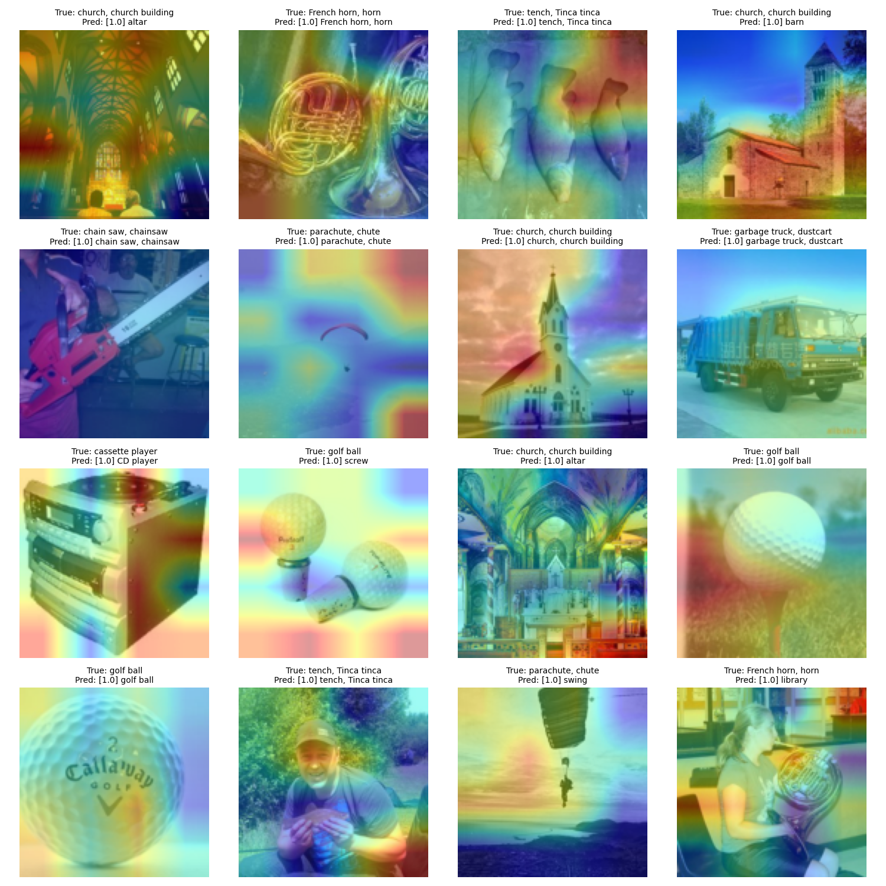
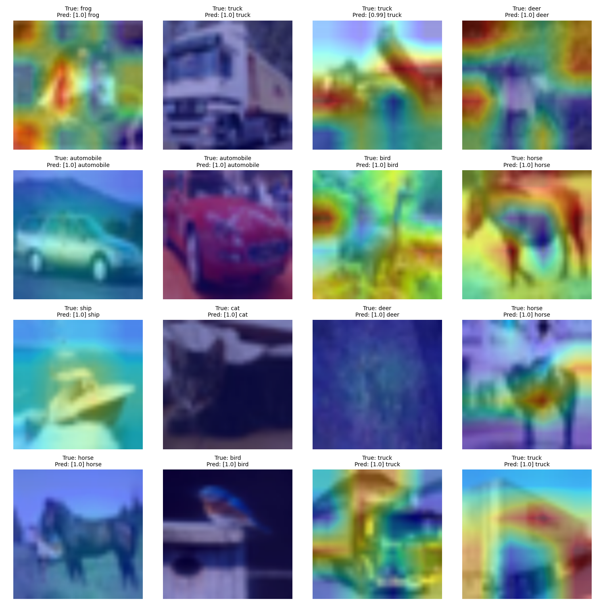

# Ablation-CAM Reproduction 
Reproduction of Ablation-CAM \[[paper](https://ieeexplore.ieee.org/document/9093360)\], a technique to visualize and interpret features learnt by Convolutional Neural Networks (CNNs).

<p float="left">
  
  
</p>

## Quickstart
The `main.py` file facilitates running of all the functionality offered by the code. It accepts several command line arguments, which are explained below.

| Argument           | Possible values                       | Description                                                                                                                                                                                                                                                                                                                                                                                                                                                                                                                                                                                                                                                                                                                       |
|--------------------|---------------------------------------|-----------------------------------------------------------------------------------------------------------------------------------------------------------------------------------------------------------------------------------------------------------------------------------------------------------------------------------------------------------------------------------------------------------------------------------------------------------------------------------------------------------------------------------------------------------------------------------------------------------------------------------------------------------------------------------------------------------------------------------|
| `task`             | `train`, `viz`                        | Pass `train` to finetune a model on CIFAR-10 dataset or `viz` to visualize the localization maps of few images from a specified dataset.                                                                                                                                                                                                                                                                                                                                                                                                                                                                                                                                                                                          |
| `model`            | `vgg`, `resnet18`, `resnet50`         | Architecture to be used. Current options are `vgg` (VGG-16), `resnet18` (ResNet-18) and `resnet50` (ResNet-50).                                                                                                                                                                                                                                                                                                                                                                                                                                                                                                                                                                                                                   |
| `data-root`        | `data/cifar10`, `data/imagenet/train` | Path to directory containing images to be used. Currently the code supports use of ImageNet and CIFAR-10 datasets, and they need to be organized inside main as follows: **For CIFAR-10**: Specify the value for this argument as `data/cifar10`. The torchvision version of the dataset will be downloaded inside `main/data/cifar10` and will be ready to use. **For ImageNet**: I've used a smaller version of the dataset, called [ImageNette](https://github.com/fastai/imagenette) which contains 10 handpicked classes out of 1000 with few images in each. Download the dataset from [HERE](https://drive.google.com/file/d/1Qh0grnTFRJzQjrBgja1yWSYI_fR_q3fy/view?usp=sharing) and extract it inside `main/data/imagenet` such that `train/` and `val/` are available directly inside `main/data/imagenet`. Then pass `data/imagenet/train` to this argument. |
| `model-ckpt`       | -                                     | Path to model checkpoint to be loaded. This is used when visualization is being done on CIFAR-10.                                                                                                                                                                                                                                                                                                                                                                                                                                                                                                                                                                                                                                 |
| `batch-size`       | Default: `16`                         | Batch size for training or visualization.                                                                                                                                                                                                                                                                                                                                                                                                                                                                                                                                                                                                                                                                                         |
| `method`           | `channel`, `spatial`                  | Pass `channel` (default) to use the paper's method or `spatial` to perform location-wise ablation instead of channel-wise.                                                                                                                                                                                                                                                                                                                                                                                                                                                                                                                                                                                                        |
| `final-activation` | `relu`, `softmax`                     | Activation function for the localization map after it is generated from the weighted sum. Pass `relu` (default) or `softmax`.                                                                                                                                                                                                                                                                                                                                                                                                                                                                                                                                                                                                     |
| `clf-activation`   | `softmax`, `sigmoid`                  | Activation function to convert classifier logits into probabilities. Pass `softmax` (default) or `sigmoid`.                                                                                                                                                                                                                                                                                                                                                                                                                                                                                                                                                                                                                       |
| `num-batches`      | Default: `1`                          | Number of batches to process for visualization task. Ignored for `train` task.                                                                                                                                                                                                                                                                                                                                                                                                                                                                                                                                                                                                                                                    |

For example, to visualize the localization maps for one batch of ImageNette using a pretrained ResNet-18, run the following inside `main/`:

```
python3 main.py --task viz                          \
                --model resnet18                    \
                --data-root data/imagenet/train     \
                --batch-size 16                     \
                --method channel                    \
                --final-activation relu             \
                --clf-activation softmax            \
                --num-batches 1
```

As another example, to visualize the localization maps for one batch of CIFAR-10 using fine-tuned VGG-16 saved at `main/outputs/models/vgg.ckpt`, run the following inside `main/`:


```
python3 main.py --task viz                                    \
                --model vgg                                   \
                --data-root data/cifar10                      \  
                --batch-size 16                               \
                --method channel                              \
                --final-activation relu                       \
                --clf-activation softmax                      \
                --model-ckpt outputs/models/vgg.ckpt          \
                --num-batches 1
```


## CIFAR-10 fine-tuned models
I have fine-tuned some models on CIFAR-10 to perform visualization on simpler images compared to ImageNet (classifier modified to have 10 outputs and trained for 10 epochs, images resized to 128 because Ablation-CAM fails on small images sizes). Each model achieved close to 93% validation accuracy. The trained weights can be found below.

  - VGG-16    : [Download](https://drive.google.com/file/d/1OqpowfeUzBZfOi08b1gdA8LAUvzzllwz/view?usp=sharing)
  - ResNet-18 : [Download](https://drive.google.com/file/d/1PraHNHXm1s2bsotTNGQmmb52D6zHOr8z/view?usp=sharing)
  - ResNet-50 : [Download](https://drive.google.com/file/d/12Q1wTIfZjoEvtBGCdCvgKIJl9HLsgNqU/view?usp=sharing)
